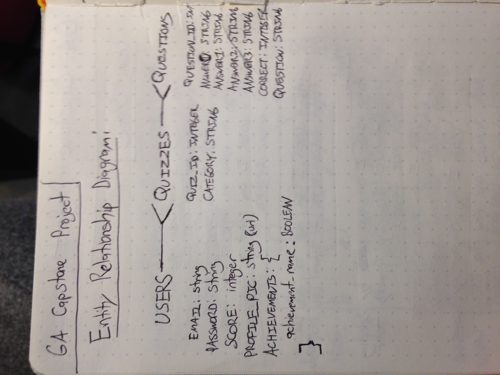
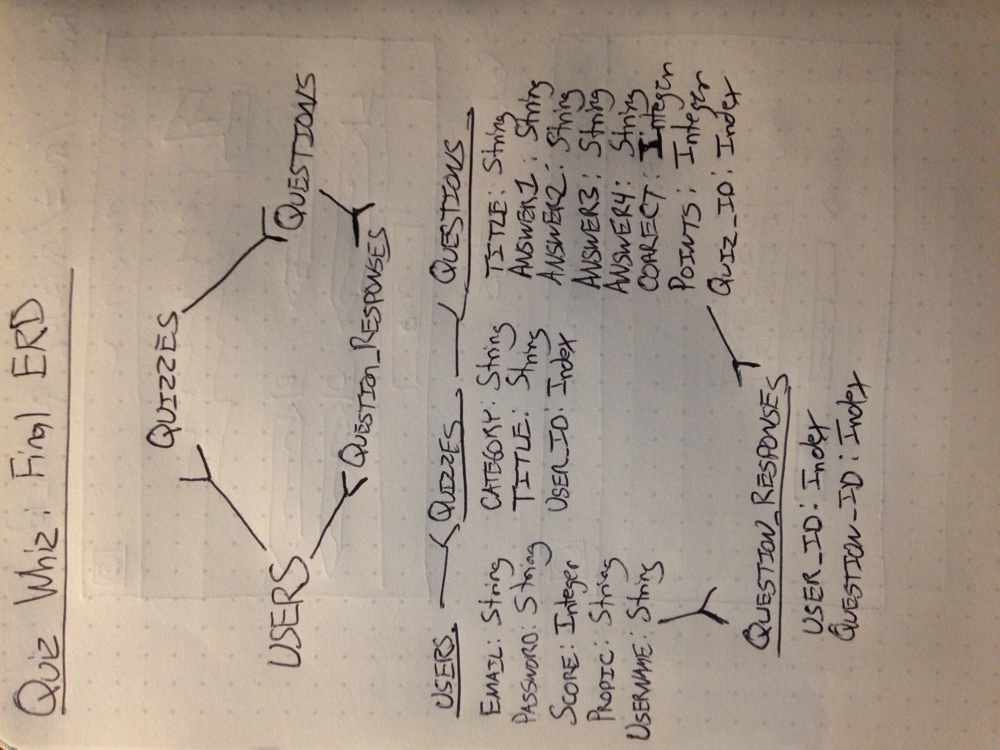

# Quiz Whiz Back End

## Capstone project for General Assembly

### Introduction

Quiz Whiz is an Ember.js application for users to create and share quizzes. The project uses this Ruby on Rails back end to create, read, update, and delete information pertaining to users, quizzes, and quiz questions.

Link to Ruby on Rails Front-End Repository: https://github.com/Aaron-Vale/quiz-whiz
Link to Deployed Front-End: https://aaron-vale.github.io/quiz-whiz/
Link to Deployed Back-End: https://intense-harbor-78867.herokuapp.com/

### Entity Relationship Diagrams

Original:

Final:

### API Endpoints

#### Authentication

| Verb   | URI Pattern            | Controller#Action |
|--------|------------------------|-------------------|
| POST   | `/sign-up`             | `users#signup`    |
| POST   | `/sign-in`             | `users#signin`    |
| PATCH  | `/change-password/:id` | `users#changepw`  |
| DELETE | `/sign-out/:id`        | `users#signout`   |
| GET    | `/users`               | `users#index`     |
| GET    | `/users/:id`           | `users#show`      |
| GET    | `/users`               | `users#index`     |
| PATCH  | `/users/:id`           | `users#update`    |

Note: #update action only allows users to update their profile image, score, and username.

#### Quizzes

| Verb   | URI Pattern            | Controller#Action |
|--------|------------------------|-------------------|
| GET    | `/quizzes`             | `quizzes#index`   |
| GET    | `/quizzes/:id`         | `quizzes#show`    |
| POST   | `/quizzes`             | `quizzes#create`  |
| PATCH  | `/quizzes/:id`         | `quizzes#update`  |
| DELETE | `/quizzes/:id`         | `quizzes#destroy` |

Note: quizzes#index returns quizzes in alphabetical order by category.

#### Questions

| Verb   | URI Pattern            | Controller#Action  |
|--------|------------------------|--------------------|
| GET    | `/questions`           | `questions#index`  |
| GET    | `/questions/:id`       | `questions#show`   |
| POST   | `/questions`           | `questions#create` |
| PATCH  | `/questions/:id`       | `questions#update` |
| DELETE | `/questions/:id`       | `questions#destroy`|

#### Question_Responses

| Verb   | URI Pattern            | Controller#Action            |
|--------|------------------------|------------------------------|
| GET    | `/question_responses`  | `question_responses#index`   |
| POST   | `/question_responses`  | `question_responses#create`  |

### Technologies Used

Ruby on Rails, cURL

### Planning, Process and Problem-Solving Strategy

This back end structure ended up being far more complex than anything I had attempted previously. I originally planned to include three resources in Users, Quizzes, and Questions, with a user having many quizzes, and a quiz having many questions. This alone meant writing more cURL scripts to test the additional API endpoints, but as the development process continued, I decided to add additional functionality to my front end that required making changes to the back end.

I originally started by testing the API endpoints for the users resource, as well as adding in additional table columns in the database to incorporate usernames, profile images, as well as keeping track of a user's score. I added in default values for a profile image, as well as for starting off a user's score at 0. I then had to build out actions to handle changes to username, profile images, and score.

For the quizzes resource, I generated a scaffold, and added a one-to-many relationship between users and quizzes.

Once I had built and tested the quizzes resource, I added a second one-to-many relationship between quizzes and questions.

At a certain point in developing the front-end, I realized that I needed a way to track whether or not a user has previously answered a particular quiz question, so that they could only earn or lose points from that question one time. In order to do this, I constructed a fourth resource, which I called question_responses, that act as an intermediary in a many-to-many relationship between users and questions. Question_responses simply consist of a user_id as well as a question_id. When a user answers a question for the first time, it creates a new question_response. Each time a user answers a question, it will first check to see if a record exists for a user having answered that quiz question.

### Future Additions

One feature I'd like to implement on the front-end are achievements. This will require adding to the users resource in order to keep track of a user's achievements.
